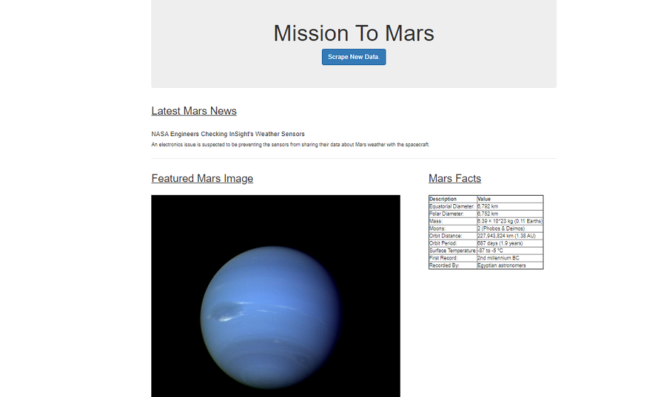
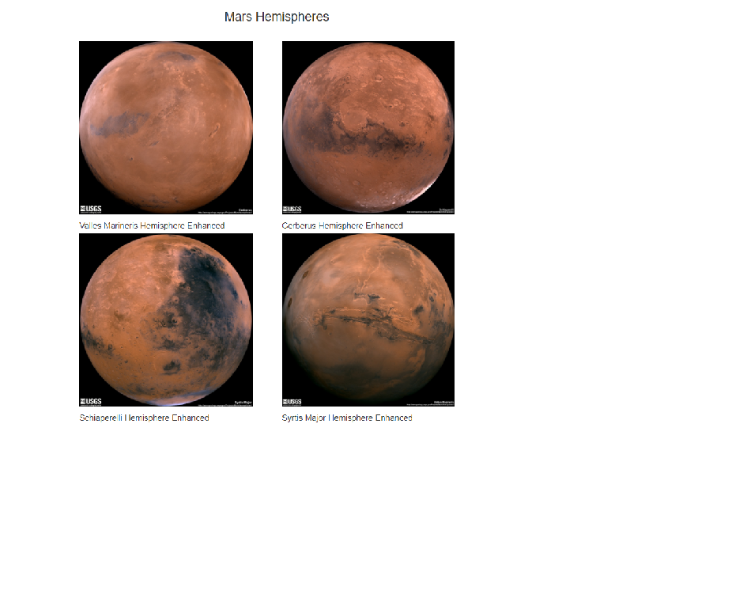

# Web Scraping Homework - Mission to Mars

In this assignment, the task was to build a web application that scrapes 4 different websites for data related to the Mission to Mars and displays the information in a single HTML page.

The following steps were followed in order to achieve this objective:

## Scraping
### NASA Mars News
https://mars.nasa.gov/news/ website was used to get the latest news on Mars mission using BeautifulSoup, splinter, pandas in a jupyter notebook.

### JPL Mars Space Images - Featured Image
https://www.jpl.nasa.gov/spaceimages/?search=&category=Mars was used to scrape the featured image of mars in full resolution.

### Mars Facts
https://space-facts.com/mars/ was used to obtain the table containing facts about the planet including diameter, mass, etc.

### Mars Hemispheres
https://astrogeology.usgs.gov/search/results?q=hemisphere+enhanced&k1=target&v1=Mars was used to obtain high resolution images for each of Mars hemispheres.

## Flask
A Python script was designed to run all of the scraping code and all of the scraped data was put into one Python dictionary.

'/scrape' route which will import the Python script and call the scrape function was created.

## MongoDB:
A new database and a new collection was created.

All of the scraped data was stored in the above created database.

Root route / that  queries the database and passes the Mars data into HTML template was created.

## HTML file
Finally a HTML file called 'index.html' was created that displayed all of the data in HTML elements.

